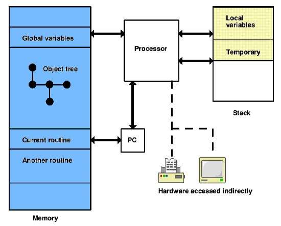

image:iconov.gif[image]

== Overview of Z-machine architecture

'''''

The Z-machine is a design for an imaginary computer: Z is for 'Zork', the adventure game it was originally designed to play. Like any computer, it stores its information (mostly) in an array of variables numbered from 0 up to some large number: this is called its *memory*. A stock of some 240 memory locations are set aside for easy and quick access, and these are called *global variables* (since they are available to any part of the program which is running, at any time).

The two important pieces of information not stored in memory are the *program counter* (PC) and the *stack*. The Z-machine continuously runs a program by getting the instruction stored at position PC in memory, acting on the instruction and then moving the PC forward to the next. The *instruction set* of the Z-machine (the range of possible actions and how they are encoded as numbers in memory) occupies much of this document.

Programs are divided into *routines*: the Z-machine is always executing a particular routine, the one which the PC currently points inside. However, some instructions cause the Z-machine to *call* a new routine and then to return where the first routine left off. The Z-machine therefore needs to remember details of where to go back, and it stores these on the stack.

The stack is a second bank of memory, quite separate from the main one, which has variable size: initially it is empty. From time to time values are added to, or taken from, the top of the stack. As well as being used to keep return details, the stack is also used to store *local variables* (values needed only by a particular routine) and, for short periods only, the partial results of calculations.

Thus, whereas most physical processors (e.g. Z80 or 6502) have a number of quick-access variables outside of memory (called "registers") and a stack inside memory, the Z-machine has the reverse: it has global variables inside memory and a stack kept outside.

There is no access to hardware except by executing particular Z-machine instructions. For instance, *read* and *read_char* allow use of the keyboard; *print* and *draw_picture* allow use of the screen. The screen's image is not stored anywhere in memory. Conversely, hardware can cause the Z-machine to *interrupt*, that is, to make a spontaneous call to a particular routine, interrupting what it was previously working on. This happens only if the program has previously requested it: for example, by setting a sound effect playing and asking for a routine to be called when it finishes; or by asking for an interrupt if thirty seconds pass while the player is thinking what to type.

'''''

This simple architecture is overlaid by a number of special structures which the Z-machine maintains inside memory. There are around a dozen of these but the most important are:

* the *header*, at the bottom of memory, giving details about the program and a map of the rest of memory;
* the *dictionary*, a list of English words which the program expects that it might want to read from the keyboard;
* the *object tree*, an arrangement of chunks of memory called *objects*.

The Z-machine is primarily used for adventure games, where the dictionary holds names of items and verbs that the player might type, and the objects tend to be the places and artifacts which make up the game. Each object in the tree may have a *parent*, a *sibling* and a *child*. For instance, in the start position of 'Zork I':

____
*West of House*

You are standing in an open field west of a white house, with a boarded front door. There is a small mailbox here.

>open mailbox

Opening the small mailbox reveals a leaflet.
____

At this point (part of) the game's object tree looks like this:

....
[ 41] ""
 . [ 68] "West of House"
 .  . [ 21] "you"
 .  . [239] "small mailbox"
 .  .  . [ 80] "leaflet"
 .  . [127] "door"
....

Note that objects are numbered from 1 upward. (Object 41 is a dummy object being used by the game to contain all the "rooms" or locations, and it has many more children besides object 68.) The parent of the player is "West of House", whose parent is 41, which has no parent. The sibling of the player is the mailbox; the child of the mailbox is the leaflet; the sibling of the mailbox is the door and so on.

Objects are bundled-up collections of variables, which come in two kinds: *attributes* and *properties*. Attributes are simply flags, that is, they can be set or unset, but have no numerical value. Properties hold numbers, which may in turn represent pieces of text or other information. For instance, one of the properties of the mailbox object above contains the information that the English word "mailbox" refers to it. One of the attributes of the mailbox object is set to indicate that it's a container, whereas the same attribute for the leaflet object is unset. Here is a breakdown of the state of the mailbox:

....
239. Attributes: 30, 34
     Parent object:  68  Sibling object: 127  Child object:  80
     Property address: 2b53
         Description: "small mailbox"
          Properties:
              [49] 00 0a
              [46] 54 bf 4a c3
              [45] 3e c1
              [44] 5b 1c
....

So the only set attributes are 30 and 34: all others are unset. Values are given for properties 44, 45, 46 and 49. The Z-machine itself does not know or care what this information means: that is for the program to sort out.

As a final example, here is part of one of the routines in 'Zork I':

....
l0006: print_ret       "Suicide is not the answer."
l0007: je              g57 #84 ~l0008
       je              g48 #15 ~rfalse
       print_ret       "Why don't you just walk like normal people?"
l0008: je              g57 #63 ~l0009
       print_ret       "How romantic!"
l0009: je              g57 #3b ~rfalse
       get_parent      "mirror" local0
       get_parent      "mirror" sp
       je              g6b local0 sp ~l0010
       print_ret       "Your image in the mirror looks tired."
l0010: print_ret       "That's difficult unless your eyes are prehensile."
....

'''''

Z-machine programs are stored on disc, or archived on the Internet, in what are called *story files*. (Since they were introduced to hold interactive stories.) A story file consists of a snapshot of main memory only. The processor begins to run a story file by starting with an empty stack and a PC value set according to some information in the story file's header. Note that the story file has to be set up with many of the structures in memory, such as the dictionary and the object tree, already created and with sensible contents.

The first byte of any story file, and so the byte at memory address 0, always contains the *version number* of the Z-machine to be used. The design was evolutionary over a period of a decade: as version number increases, the instruction set grows and tables are reformatted to allow more room for larger games. All of Infocom's games can be played using versions between 3 (the majority) and 6. Games compiled by Inform mainly use versions 5 or 8.

'''''

link:index.html[Contents] / link:preface.html[Preface] / link:overview.html[Overview]

Section link:sect01.html[1] / link:sect02.html[2] / link:sect03.html[3] / link:sect04.html[4] / link:sect05.html[5] / link:sect06.html[6] / link:sect07.html[7] / link:sect08.html[8] / link:sect09.html[9] / link:sect10.html[10] / link:sect11.html[11] / link:sect12.html[12] / link:sect13.html[13] / link:sect14.html[14] / link:sect15.html[15] / link:sect16.html[16]

Appendix link:appa.html[A] / link:appb.html[B] / link:appc.html[C] / link:appd.html[D] / link:appe.html[E] / link:appf.html[F]

'''''
